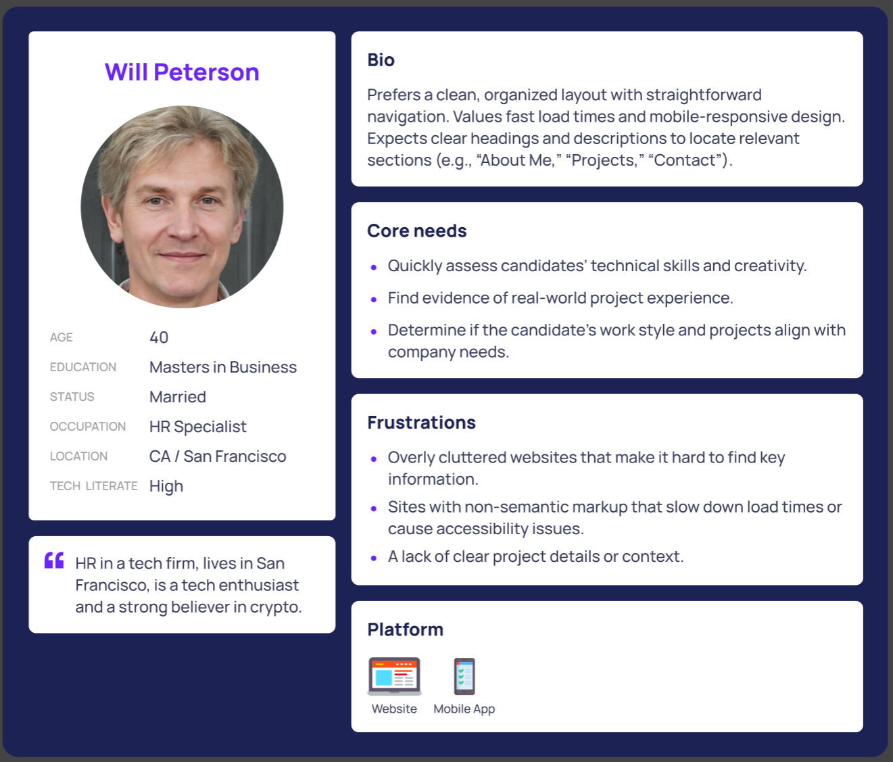
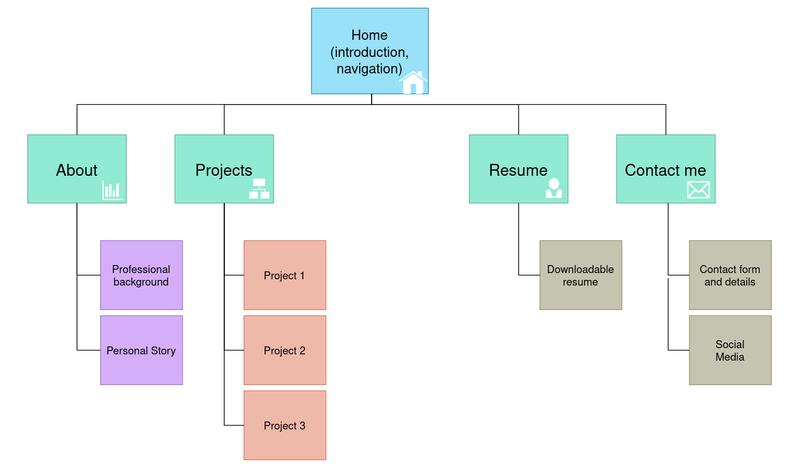
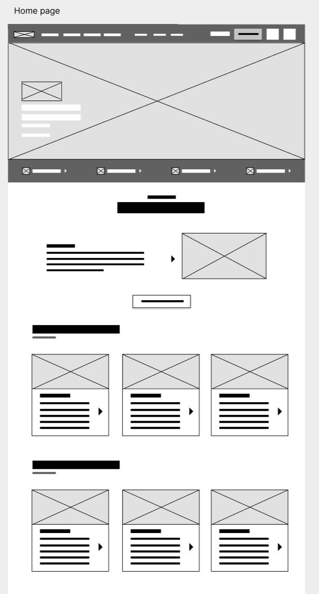
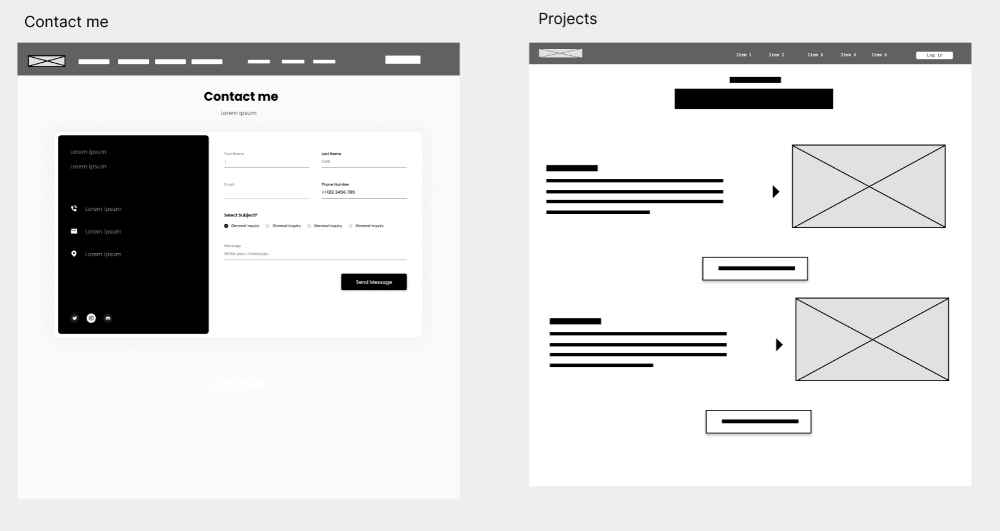

# Personal Portfolio Site – Design Plan

---

## 1. Site Purpose Summary

**Overview:**  
This personal portfolio website is designed to showcase my professional work, skills, projects, and background. It serves as both a digital resume and a demonstration of my web development abilities, aiming to impress potential employers and collaborators while providing a clear, user-centered experience.

---

## 2. Audience Considerations

### Persona Diagram

**Persona Name:** Will Peterson
**Age:** 40  
**Role:** Hiring Manager / HR Specialist at a Technology Firm

**Goals:**

- Quickly assess candidates’ technical skills and creativity.
- Find evidence of real-world project experience.
- Determine if the candidate’s work style and projects align with company needs.

**Frustrations/Pain Points:**

- Overly cluttered websites that make it hard to find key information.
- Sites with non-semantic markup that slow down load times or cause accessibility issues.
- A lack of clear project details or context.

**Behavior and Preferences:**

- Prefers a clean, organized layout with straightforward navigation.
- Values fast load times and mobile-responsive design.
- Expects clear headings and descriptions to locate relevant sections (e.g., “About Me,” “Projects,” “Contact”).



https://www.figma.com/design/edmXxisZQ3u6tWAWdoGZnw/User-Persona-Template-(Community)?node-id=0-1&t=0ZHf9Tce601LCVfc-1

---

## 3. Site Diagram

### Overall Structure

The site will include the following pages, each with clear navigation labels and corresponding file names:

- **Home (index.html)**
  - Serves as the landing page with a brief introduction and navigation to other sections.
- **About (about.html)**
  - Provides a detailed biography, personal story, and professional background.
- **Projects (projects.html)**
  - Showcases portfolio pieces with images, project descriptions, and links.
- **Resume (resume.html)**
  - Offers a downloadable resume and an online summary of skills and experiences.
- **Contact (contact.html)**
  - Contains a contact form, social media links, and additional contact details.



_Annotations:_

- **Home:** Central hub linking to all other pages.
- **About:** Provides detailed personal and professional background.
- **Projects:** Showcases work examples with visual and textual descriptions.
- **Resume:** Presents skills, experiences, and achievements.
- **Contact:** Enables direct communication and networking.

---

## 4. Wireframes

### Low-Fidelity Wireframe for the Home Page

The idea for the main page is as follows:

```
 -------------------------------------------------
|                     HEADER                      |
|  [Logo]    [Home] [About] [Projects] [Contact]  |
 -------------------------------------------------
|                   HERO SECTION                  |
|        [Large Image or Illustration]            |
|  "Welcome! I am Daniel ... , a Web Developer"   |
 -------------------------------------------------
|                INTRODUCTION BLOCK               |
|   - Brief introduction paragraph                |
|   - Call-to-action (e.g., "View My Work")       |
 -------------------------------------------------
|                FEATURED PROJECTS                |
|  [Thumbnail 1]   [Thumbnail 2]   [Thumbnail 3]  |
 -------------------------------------------------
|                     FOOTER                      |
|  [Social Media Icons] | [Email Address]         |
 -------------------------------------------------
```

Which can look the following way:



### Wireframes for other pages



https://www.figma.com/design/xiIvfNcSUWfsoxxOC7jWNA/Low-fi-Wireframe-Template-(Community)?node-id=2-2&t=VgTDRtbAoPQWWAyI-1

---

## 5. Technical Requirements

### **1. Technologies**

- **Frontend:** HTML, CSS, JavaScript, Web Components, Progressive Enhancement
- **Backend:** Serverless (Netlify Functions, Firebase), In case I will be self-hosting - Node.js
- **Hosting & Deployment:** Netlify, GitHub Actions, CDN caching via Cloudflare? / GitLab CI-CD in case of self-hosting

### **2. Performance & Optimization**

- **Page Speed:** FCP < 1s, Lighthouse Score 90+
- **Asset Optimization:** WebP/AVIF images, lazy loading, minification, Gzip/Brotli compression
- **Responsive Design:** Mobile/Desktop, CSS Grid/Flexbox, adaptive images?
- Each page is designed to be lightweight, with an ideal page delivery target under 100 KB.

### **3. Accessibility & Security**

- **WCAG 2.1 AA Compliance:** High contrast, keyboard navigation, alt text
- **Security:** HTTPS, CSP, no inline JS, CORS policies

### **4. Features**

- **Contact Form:** Validation, Netlify Forms/Firebase
- **Projects Section:** JSON/CMS data, filtering, dynamic content
- **Dark Mode:** CSS variables, localStorage preference

### **5. Compatibility**

- **Browsers:** Chrome, Firefox, Edge, Safari (latest 3 major versions)
- **Devices:** Mobile (<480px), Tablet (481-1024px), Desktop (1025-1440px)

### **6. API & Third-Party Integrations**

- **Analytics:** Google Analytics/Plausible, Netlify Analytics
- **APIs:** GitHub (projects), possibly something for social media

### **7. Future Enhancements**

- **PWA support** (offline access)
- **WebSockets/SSE** (real-time updates)

### **8. Hosting:**

- The website will be hosted on [Netlify](https://www.netlify.com/) or from home on Orange Pi 5.
- Final URL: `https://katulevskiyportfolio.netlify.app/`

---

## 6. Content Requirements

- **Text Content:**

  - A concise personal biography.
  - Detailed descriptions for each project.
  - A professional summary and skills list (for the resume page).
  - Clear and accessible copy for navigation and call-to-action elements.

- **Media Assets:**

  - A headshot or avatar.
  - Project screenshots and/or mockups.
  - Icons for social media links.

- **Additional Resources:**
  - Downloadable resume in PDF format.
  - Links to professional profiles (e.g., LinkedIn, GitHub).
  - Accessibility-focused features (e.g., alt text for images).

---

## 7. Website Link

**Hosted Site URL:**  
`https://katulevskiyportfolio.netlify.app/`
